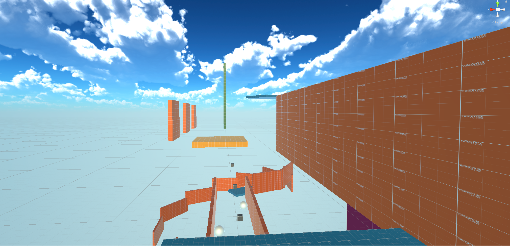

# Level-Design-Surf

Inspiracja Tryb Surf z Counter Strike 1.6
Paczka ze skryptami jest od tego pana. : https://www.youtube.com/c/DaniDev  

# Screenshots
### <b>Map</b> 

### <b>Stage 1 </b> 

### <b>Stage 2</b> 

### <b>Stage 3 </b> 

### <b>Stage 4</b> 

## Sterowanie
WSAD  
Jump - Spacja   
jest Double Jump   
Ctrl - Boost   

Przyklejimy sie do sciany uzywajac A/D podczas biegu w zależności od położenia platformy.  
Skok podczas bycia przyklejonym jak go dobrze uzyjemy potrafi nas przyspieszyc.   

## Platformy
Pomaranczowy - Scianka do biegania   
Zielony - Drabinka do wspinania  
Niebieski - Ground  

Czerwony Jump Pad - wybija do gory 
Zółty Jump Pad - wybija w przód ( przy odpowiednim timingu z nacisnieciem spacji wybija nas dalej )   
Zółty Ring - Wybija w przod po wleceniu w niego   

Jesli chodzi o skrót dla spotrzegawczych . ( Jesli odbijemy sie od pierwszej drabinki w tyl, zamiast w przod. pominiemy jeden Stage mapki ,można to zauwazyc jak poaptrzymy sie wczesniej w góre)  
